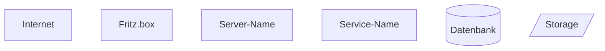

# Infrastructure Documentation Process

## Zweck

Dieses Dokument beschreibt den iterativen Prozess zur Erstellung und Pflege der Infrastruktur-Dokumentation des setz-php Projekts. Der Prozess dient der präzisen Erfassung der physischen und logischen Systemarchitektur sowie der kontinuierlichen Security-Analyse.

## Prinzipien

1. **Iterativ von außen nach innen** - Beginne mit High-Level Übersicht, verfeinere sukzessive
2. **Präzise, aber einfach** - Genauigkeit ohne unnötige Komplexität
3. **Konsens vor Fortschritt** - Beide Seiten müssen zustimmen bevor weiter gemacht wird
4. **Versioniert** - Jede Iteration wird committed
5. **Security-fokussiert** - Angriffsvektoren werden kontinuierlich dokumentiert

## Dateiorganisation

```
docs/
├── CLAUDE.md              # Diese Datei - Prozess-Dokumentation
├── Infrastructure.md      # Haupt-Dokumentation (Mermaid inline + Text)
├── Infrastructure.mmd     # Reine Mermaid-Datei für visuelle Kontrolle
└── DevOpsFlow.md          # Workflow-Dokumentation (bereits vorhanden)
```

### Dateien und ihre Rollen

**CLAUDE.md** (diese Datei)
- Prozess-Beschreibung
- Workflow-Guidelines
- Meta-Dokumentation für zukünftige Arbeit

**Infrastructure.md**
- Single Source of Truth für Infrastruktur
- Mermaid-Diagramme inline
- Textuelle Erklärungen zu jeder Komponente
- Wächst kontinuierlich
- Kann später aufgeteilt werden wenn zu groß

**Infrastructure.mmd**
- Identisches Mermaid-Diagramm wie in Infrastructure.md
- Nur das Diagramm, keine zusätzliche Dokumentation
- Für schnelle visuelle Kontrolle in Mermaid-Editoren
- Wird synchron mit Infrastructure.md gepflegt

## Workflow pro Iteration

### 1. Frage formulieren

**Beispiel:**
```
Iteration N: Internet-Anbindung
Frage: Welcher Provider? Wie viele Leitungen? Redundanz?
```

### 2. Antwort diskutieren

- Benutzer beantwortet Frage
- Klärung von Unklarheiten
- Diskussion von Security-Implikationen

### 3. Dokumentation aktualisieren

**Beide Dateien synchron bearbeiten:**

a) **Infrastructure.md**
   - Mermaid-Diagramm erweitern
   - Textuelle Erklärung hinzufügen
   - Security-Notizen ergänzen

b) **Infrastructure.mmd**
   - Identisches Mermaid-Diagramm
   - Keine zusätzlichen Texte

### 4. Review-Checkpoint

**Checklist vor Abschluss der Iteration:**
- [ ] Frage vollständig beantwortet?
- [ ] Diagramm zeigt neue Information korrekt?
- [ ] Text erklärt Zusammenhänge und Konfiguration?
- [ ] Keine Widersprüche zu vorherigen Iterationen?
- [ ] Security-Implikationen dokumentiert?
- [ ] Infrastructure.md und Infrastructure.mmd sind synchron?
- [ ] Beide Seiten (Benutzer + Claude) stimmen zu?

### 5. Commit

**Commit-Message Format:**
```
docs(infra): iteration N - <Thema>

- Frage: <Was wurde geklärt>
- Diagramm: <Was hinzugefügt/geändert>
- Dokumentation: <Textuelle Details>
- Security: <Relevante Sicherheitsaspekte>
```

**Beispiel:**
```
docs(infra): iteration 1 - Fritz.box Router

- Frage: Welcher Router ist im Einsatz?
- Diagramm: Fritz.box Knoten hinzugefügt
- Dokumentation: Router-Modell und Konfiguration
- Security: Firewall-Regeln, Port-Forwarding
```

### 6. Nächste Iteration

- Fortschritt zur nächsten Komponente
- Von außen nach innen (Internet → Router → Server → Services)

## Iterationsplan

### Phase 1: Netzwerk-Infrastruktur (außen nach innen)

1. **Internet-Anbindung**
   - Provider
   - Bandbreite
   - Redundanz

2. **Router/Gateway**
   - Modell (z.B. Fritz.box)
   - Firewall-Regeln
   - NAT-Konfiguration

3. **Netzwerk-Topologie**
   - VLANs
   - Subnetze
   - DMZ (falls vorhanden)

### Phase 2: Server-Infrastruktur

4. **Physische/Virtuelle Server**
   - Anzahl
   - Specs (CPU, RAM, Storage)
   - Betriebssysteme

5. **Storage-Systeme**
   - HDDs, SSDs
   - RAID-Konfiguration
   - NAS (falls vorhanden)

6. **Backup-Systeme**
   - Strategie (3-2-1 Regel?)
   - Lokation
   - Retention-Policy

### Phase 3: Service-Landscape

7. **Development Stage**
   - Coder Workspace
   - Entwicklungs-Datenbank

8. **Staging Stage**
   - Test-Environment
   - Staging-Datenbank

9. **Production Stage**
   - setz.de (Webserver)
   - nc.setz.de (Nextcloud)
   - Produktions-Datenbank

10. **Support-Services**
    - CI/CD Pipeline
    - Monitoring
    - Logging
    - Download-Server

### Phase 4: Security-Analyse

11. **Verschlüsselung**
    - TLS/SSL-Zertifikate
    - Verschlüsselung at rest
    - VPN-Verbindungen

12. **Authentifizierung & Autorisierung**
    - SSH-Keys
    - Benutzer-Management
    - Zugriffsrechte

13. **Monitoring & Alerting**
    - Intrusion Detection
    - Log-Aggregation
    - Health-Checks

## Mermaid-Diagramm Konventionen

### Node-Typen und Styling



### Verbindungstypen

- `-->` Standardverbindung
- `-.->` Optionale/Backup-Verbindung
- `==>` Verschlüsselte Verbindung
- `-- Text -->` Verbindung mit Label

## Security-Analyse Guidelines

Bei jeder Iteration dokumentieren:

1. **Angriffsvektoren**
   - Welche Angriffsfläche entsteht?
   - Welche Ports sind exponiert?

2. **Mitigationen**
   - Firewall-Regeln
   - Verschlüsselung
   - Authentifizierung

3. **Monitoring**
   - Wie wird diese Komponente überwacht?
   - Wie werden Anomalien erkannt?

4. **Backup/Recovery**
   - Wie wird diese Komponente gesichert?
   - Wie schnell ist Wiederherstellung möglich?

## Wartung der Dokumentation

### Wann aktualisieren?

- **Neue Komponente hinzugefügt** → Neue Iteration
- **Konfiguration geändert** → Betroffene Sektion aktualisieren
- **Security-Incident** → Security-Analyse erweitern
- **Service-Migration** → Diagramm und Dokumentation anpassen

### Wie aktualisieren?

1. Issue/Notiz erstellen mit zu änderndem Punkt
2. Iteration-Workflow durchlaufen (siehe oben)
3. Beide Dateien (Infrastructure.md + .mmd) synchron aktualisieren
4. Review-Checkpoint
5. Commit mit klarer Message

### Aufspaltung bei Wachstum

Wenn Infrastructure.md zu groß wird (> 1000 Zeilen):

```
docs/
├── CLAUDE.md
├── Infrastructure-Overview.md      # High-Level
├── Infrastructure-Overview.mmd
├── Infrastructure-Network.md       # Netzwerk-Details
├── Infrastructure-Network.mmd
├── Infrastructure-Services.md      # Service-Details
├── Infrastructure-Services.mmd
└── Infrastructure-Security.md      # Security-Analyse
```

## Tools und Hilfsmittel

### Mermaid-Editoren

- **Online:** https://mermaid.live
- **VS Code:** Mermaid Preview Extension
- **GitHub:** Native Mermaid-Rendering in Markdown

### Diagramm-Validation

```bash
# Syntax-Check mit mermaid-cli (optional)
npm install -g @mermaid-js/mermaid-cli
mmdc -i docs/Infrastructure.mmd -o test.svg
```

### Review-Tools

- GitHub Pull Request für größere Änderungen
- Direct Commit für kleine iterative Updates

## Versionierung

- **Semantic Versioning für Dokumentation** (optional)
- Git-Tags bei Meilensteinen (z.B. "infra-doc-v1.0" nach vollständiger Ersterfassung)
- Jede Iteration = 1 Commit

## Best Practices

1. **Klein anfangen** - Nicht alles auf einmal erfassen
2. **Konsistent bleiben** - Naming-Conventions einhalten
3. **Security first** - Immer Sicherheitsaspekte betrachten
4. **Regelmäßig reviewen** - Quartalsweise Aktualität prüfen
5. **Änderungen tracken** - Git-History nutzen

---

*Erstellt: 2025-10-02*
*Version: 1.0*
*Nächstes Review: 2026-01-02*
