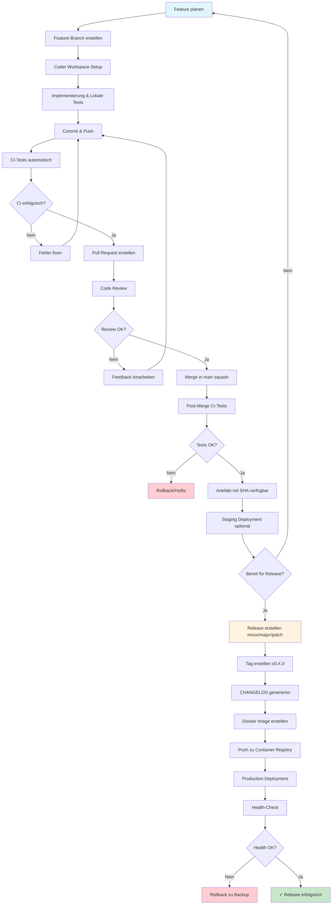

# DevOps Workflow - setz-php Projekt

## Workflow-Visualisierung



## Überblick

Dieser Workflow folgt einer vereinfachten **Trunk-Based Development** Strategie mit **Feature Branches** und **Semantic Versioning**. Der Ansatz ist für kleine bis mittlere Projekte optimiert und balanciert Einfachheit mit Qualitätssicherung.

## Branch-Strategie

**Basis:** `main` Branch (Main Development Branch)

**Begründung:**
- Ein zentraler Main-Branch reduziert Komplexität für kleine Teams
- Feature-Branches ermöglichen parallele Entwicklung ohne Konflikte
- Kurzlebige Feature-Branches (< 3 Tage) minimieren Merge-Komplexität
- `main` ist der moderne Standard (seit 2020, ersetzt `master`)

## Workflow-Phasen

### Phase 1: Feature-Planung

**Was:** Feature definieren und benennen

**Begründung:** Klare Feature-Definition verhindert Scope Creep und ermöglicht besseres Tracking

**Naming Convention:**
```
feature/<kurze-beschreibung>    # Neue Features
bugfix/<issue-beschreibung>     # Bugfixes
hotfix/<kritischer-bug>         # Dringende Produktionsfixes
```

**Beispiele:**
- `feature/user-authentication`
- `bugfix/contact-form-validation`
- `hotfix/payment-gateway-timeout`

---

### Phase 2: Branch erstellen

**Kommandos:**
```bash
# Sicherstellen, dass main aktuell ist
git checkout main
git pull origin main

# Feature-Branch erstellen
git checkout -b feature/<feature-name>
```

**Begründung:** Immer von aktuellstem `main` branchen, um Merge-Konflikte zu minimieren

---

### Phase 3: Development auf Coder Workspace

**Setup:**
1. Auf https://coder.setz.de navigieren
2. Neues Workspace erstellen mit Template: `coder-laravel-template`
3. Bei Erstellung Branch angeben: `feature/<feature-name>`

**Kommandos im Workspace:**
```bash
# Branch verifizieren
git branch --show-current

# Dependencies installieren (falls nötig)
composer install
npm install

# Development Server starten
php artisan serve
```

**Begründung:**
- Coder Workspace bietet konsistente Entwicklungsumgebung
- Template stellt sicher, dass alle notwendigen Tools vorhanden sind
- Isolierte Umgebung verhindert "works on my machine" Probleme

---

### Phase 4: Implementierung & Lokale Tests

**Test-Driven Development (empfohlen):**
```bash
# 1. Test schreiben
php artisan make:test FeatureNameTest

# 2. Test ausführen (sollte fehlschlagen)
php artisan test

# 3. Feature implementieren

# 4. Test erneut ausführen (sollte erfolgreich sein)
php artisan test

# 5. Code Quality prüfen
./vendor/bin/pint  # Laravel Code Style Fixer
```

**Begründung:**
- TDD stellt sicher, dass Features testbar und wartbar sind
- Lokale Tests finden Fehler früh (vor CI)
- Code Quality Tools halten Code konsistent

**Commit Guidelines:**
```bash
# Atomare Commits (eine logische Änderung pro Commit)
git add <geänderte-dateien>
git commit -m "feat: kurze Beschreibung der Änderung

Detaillierte Erklärung warum diese Änderung notwendig war.
Referenzen zu Issues falls vorhanden.

🤖 Generated with [Claude Code](https://claude.com/claude-code)

Co-Authored-By: Claude <noreply@anthropic.com>"
```

**Commit Message Convention:**
- `feat:` - Neues Feature
- `fix:` - Bugfix
- `refactor:` - Code-Umstrukturierung ohne Funktionsänderung
- `test:` - Tests hinzufügen oder anpassen
- `docs:` - Dokumentation
- `chore:` - Build-Prozess, Dependencies, etc.

**Begründung:** Strukturierte Commit-Messages ermöglichen automatische Changelog-Generierung

---

### Phase 5: Push & CI-Tests

**Kommandos:**
```bash
# Branch zum Remote pushen
git push -u origin feature/<feature-name>
```

**CI-Pipeline (automatisch):**
1. Code-Checkout
2. Dependencies installieren
3. Tests ausführen (`php artisan test`)
4. Code Quality Checks
5. Build-Artefakt erstellen (optional)

**Begründung:**
- CI stellt sicher, dass Code in sauberer Umgebung funktioniert
- Automatisierte Tests verhindern Regressionen
- Frühe Fehlerkennung reduziert Debugging-Zeit

**Bei CI-Fehler:**
```bash
# Fehler lokal reproduzieren und fixen
git add <fixes>
git commit -m "fix: CI-Fehler beheben"
git push
# CI läuft automatisch erneut
```

---

### Phase 6: Pull Request erstellen

**Kommandos (via GitHub CLI):**
```bash
gh pr create \
  --base main \
  --head feature/<feature-name> \
  --title "Feature: <Kurze Beschreibung>" \
  --body "$(cat <<'EOF'
## Beschreibung
<Was wurde implementiert>

## Änderungen
- Änderung 1
- Änderung 2

## Tests
- [ ] Lokale Tests erfolgreich
- [ ] CI Tests erfolgreich
- [ ] Manuell getestet

## Screenshots (falls relevant)

🤖 Generated with [Claude Code](https://claude.com/claude-code)
EOF
)"
```

**Alternativ:** Via GitHub Web-Interface

**Begründung:**
- Pull Request ermöglicht Code Review
- Dokumentiert Änderungen für Team
- GitHub-Integration zeigt CI-Status

---

### Phase 7: Code Review

**Review-Checkliste:**
- [ ] Code folgt Projekt-Konventionen
- [ ] Tests sind vorhanden und sinnvoll
- [ ] Keine Secrets im Code
- [ ] Dokumentation aktualisiert (falls nötig)
- [ ] Performance-Implikationen berücksichtigt
- [ ] Keine unnötigen Dependencies

**Review-Kommandos:**
```bash
# PR lokal auschecken für detaillierte Prüfung
gh pr checkout <PR-Nummer>

# Tests lokal ausführen
php artisan test

# Code-Änderungen reviewen
git diff main...feature/<feature-name>
```

**Begründung:**
- Vier-Augen-Prinzip verhindert Fehler
- Knowledge-Sharing im Team
- Code-Qualität wird kontinuierlich verbessert

**Bei Review-Feedback:**
```bash
# Reviewer-Kommentare addressieren
git add <änderungen>
git commit -m "refactor: Review-Feedback eingearbeitet"
git push
# PR wird automatisch aktualisiert
```

---

### Phase 8: Merge in main

**Kommandos:**
```bash
# Via GitHub CLI (nach Review-Approval)
gh pr merge <PR-Nummer> --squash --delete-branch

# Oder via Git (falls lokal gemerged wird)
git checkout main
git pull origin main
git merge --squash feature/<feature-name>
git commit -m "feat: <Feature-Name> implementiert (#PR-Nummer)"
git push origin main
git branch -d feature/<feature-name>
git push origin --delete feature/<feature-name>
```

**Merge-Strategie: Squash Merge**

**Begründung:**
- Squash fasst alle Feature-Commits zu einem zusammen
- Hält main-Historie sauber und linear
- Vereinfacht Rollbacks (ein Commit = ein Feature)

**Post-Merge CI:**
- Automatische Tests laufen erneut auf main
- Bei Fehler: Sofortiger Rollback oder Hotfix
- Artefakt wird mit Commit-SHA markiert

---

### Phase 9: Release erstellen

**Wann:** Projekt-Maintainer entscheidet basierend auf:
- Feature-Reife
- Anzahl akkumulierter Änderungen
- Deployment-Schedule

**Semantic Versioning:**
- **Major (X.0.0):** Breaking Changes, API-Änderungen
- **Minor (0.X.0):** Neue Features, rückwärtskompatibel
- **Patch (0.0.X):** Bugfixes, keine neuen Features

**Kommandos:**
```bash
# Sicherstellen, dass main aktuell ist
git checkout main
git pull origin main

# Release erstellen (wähle: major, minor, oder patch)
./supplemental/make_release.sh minor
```

**Was passiert automatisch:**
1. Version in `VERSION.txt` wird erhöht (z.B. 0.1.0 → 0.2.0)
2. `CHANGELOG.md` wird generiert aus Git-Commits
3. Release-Commit wird erstellt
4. Git-Tag `v0.2.0` wird erstellt
5. Push zu Remote (Commit + Tag)

**Begründung:**
- Automatisierung verhindert menschliche Fehler
- Changelog wird konsistent aus Commit-Messages generiert
- Git-Tags ermöglichen präzise Reproduzierbarkeit

---

### Phase 10: Artefakt-Erstellung & Distribution

**Automatischer Prozess (via CI nach Tag-Push):**

**CI-Pipeline für Release:**
```yaml
# Beispiel: .github/workflows/release.yml
on:
  push:
    tags:
      - 'v*'

jobs:
  build:
    runs-on: ubuntu-latest
    permissions:
      contents: read
      packages: write

    steps:
      - name: Checkout code
        uses: actions/checkout@v4

      - name: Set up Docker Buildx
        uses: docker/setup-buildx-action@v3

      - name: Log in to GitHub Container Registry
        uses: docker/login-action@v3
        with:
          registry: ghcr.io
          username: ${{ github.actor }}
          password: ${{ secrets.GITHUB_TOKEN }}

      - name: Extract metadata
        id: meta
        uses: docker/metadata-action@v5
        with:
          images: ghcr.io/${{ github.repository }}
          tags: |
            type=semver,pattern={{version}}
            type=semver,pattern={{major}}.{{minor}}
            type=semver,pattern={{major}}
            type=raw,value=latest

      - name: Build and push Docker image
        uses: docker/build-push-action@v5
        with:
          context: .
          push: true
          tags: ${{ steps.meta.outputs.tags }}
          labels: ${{ steps.meta.outputs.labels }}
          cache-from: type=gha
          cache-to: type=gha,mode=max
```

**Manuelle Alternative:**
```bash
# Version aus Datei lesen
VERSION=$(cat VERSION.txt)

# Sauberes Checkout des Release-Tags
git checkout v${VERSION}

# GitHub Personal Access Token für Login (classic token mit write:packages Scope)
echo $GITHUB_TOKEN | docker login ghcr.io -u USERNAME --password-stdin

# Docker Image bauen mit GitHub Container Registry
REPO_OWNER=$(git remote get-url origin | sed 's/.*github.com[:/]\(.*\)\/.*/\1/')
REPO_NAME=$(git remote get-url origin | sed 's/.*\/\(.*\)\.git/\1/')
IMAGE_NAME="ghcr.io/${REPO_OWNER}/${REPO_NAME}"

docker build -t ${IMAGE_NAME}:${VERSION} \
             -t ${IMAGE_NAME}:latest \
             --build-arg BUILD_DATE=$(date -u +"%Y-%m-%dT%H:%M:%SZ") \
             --build-arg VERSION=${VERSION} \
             .

# Docker Image pushen
docker push ${IMAGE_NAME}:${VERSION}
docker push ${IMAGE_NAME}:latest

# Image Digest anzeigen für Verifikation
docker inspect --format='{{index .RepoDigests 0}}' ${IMAGE_NAME}:${VERSION}
```

**Begründung:**
- Docker Image kapselt komplette Laufzeitumgebung (PHP, Extensions, Konfiguration)
- GitHub Container Registry (ghcr.io) ist kostenlos für öffentliche Repositories
- Immutable Artefakte garantieren identisches Verhalten zwischen Stages
- GitHub Actions Cache (gha) beschleunigt Builds erheblich
- Image-Digest ermöglicht kryptographische Verifikation
- Automatische Semantic Version Tags (v1.2.3, v1.2, v1, latest)
- GITHUB_TOKEN wird automatisch bereitgestellt, keine zusätzlichen Secrets nötig

---

## Deployment-Prozess (Optional)

**Staging-Deployment (nach Merge):**
```bash
# Automatisch via CI auf Staging-Server mit Docker Compose
ssh deploy@staging.setz.de << 'EOF'
  cd /var/www/setz-php

  # Pull latest image
  docker compose pull app

  # Recreate container with new image
  docker compose up -d app

  # Run migrations
  docker compose exec app php artisan migrate

  # Clear and cache
  docker compose exec app php artisan config:cache
  docker compose exec app php artisan route:cache
  docker compose exec app php artisan view:cache
EOF
```

**Production-Deployment (nach Release):**
```bash
# Version festlegen
VERSION=$(cat VERSION.txt)
IMAGE_NAME="ghcr.io/thsetz/setz-php:${VERSION}"

# Image Digest für Verifikation abrufen
docker manifest inspect ${IMAGE_NAME} --verbose

# Deployment via Docker Compose auf Production
ssh deploy@setz.de << EOF
  cd /var/www/setz-php

  # Backup: Current container als Image speichern
  docker commit setz-php-app setz-php-backup:$(date +%Y%m%d-%H%M%S)

  # Update docker-compose.yml mit neuer Version
  sed -i 's|image: ghcr.io/thsetz/setz-php:.*|image: ${IMAGE_NAME}|' docker-compose.yml

  # Pull neues Image
  docker compose pull app

  # Blue-Green Deployment: Neuen Container starten
  docker compose up -d app

  # Warten bis Container healthy ist
  timeout 30 sh -c 'until docker compose ps app | grep -q "healthy"; do sleep 1; done'

  # Migrations ausführen
  docker compose exec app php artisan migrate --force

  # Cache optimieren
  docker compose exec app php artisan config:cache
  docker compose exec app php artisan route:cache
  docker compose exec app php artisan view:cache
  docker compose exec app php artisan optimize
EOF

# Health-Check
curl -f https://www.setz.de || echo "⚠️ Health-check failed!"
```

**Begründung:**
- Docker Container ermöglicht konsistente Umgebung über alle Stages
- Image-basiertes Deployment ist atomic und deterministisch
- Container-Backups ermöglichen schnellen Rollback
- Health-Checks in Docker Compose stellen sicher, dass Container bereit ist
- Blue-Green Deployment minimiert Downtime
- Keine manuelle Dependency-Installation nötig (alles im Image)

---

## Rollback-Strategie

**Bei Fehler in Production:**

**Option 1: Schneller Rollback (Container-Backup wiederherstellen)**
```bash
ssh deploy@setz.de << 'EOF'
  cd /var/www/setz-php

  # Letztes Backup-Image identifizieren
  LAST_BACKUP=$(docker images setz-php-backup --format "{{.Tag}}" | sort -r | head -1)

  # Container stoppen
  docker compose down app

  # Backup-Image als neues Image taggen
  docker tag setz-php-backup:${LAST_BACKUP} ghcr.io/thsetz/setz-php:rollback

  # docker-compose.yml temporär auf Rollback-Image setzen
  sed -i.bak 's|image: ghcr.io/thsetz/setz-php:.*|image: ghcr.io/thsetz/setz-php:rollback|' docker-compose.yml

  # Container mit Backup-Image starten
  docker compose up -d app

  # Warten bis healthy
  timeout 30 sh -c 'until docker compose ps app | grep -q "healthy"; do sleep 1; done'
EOF
```

**Option 2: Image-basierter Rollback (vorherige Version)**
```bash
# Vorherigen Release-Tag identifizieren
PREVIOUS_VERSION=$(git tag --sort=-version:refname | sed -n '2p' | sed 's/^v//')

ssh deploy@setz.de << EOF
  cd /var/www/setz-php

  # Auf vorheriges Image zurücksetzen
  sed -i 's|image: ghcr.io/thsetz/setz-php:.*|image: ghcr.io/thsetz/setz-php:${PREVIOUS_VERSION}|' docker-compose.yml

  # Pull vorheriges Image
  docker compose pull app

  # Recreate container
  docker compose up -d app

  # Warten bis healthy
  timeout 30 sh -c 'until docker compose ps app | grep -q "healthy"; do sleep 1; done'
EOF
```

**Option 3: Container-Restart (bei transienten Fehlern)**
```bash
ssh deploy@setz.de << 'EOF'
  cd /var/www/setz-php
  docker compose restart app
EOF
```

**Begründung:**
- Container-Backups ermöglichen Rollback in < 1 Minute (kein Re-Build nötig)
- Image-Tags sind immutable und deterministisch
- Docker Health-Checks garantieren funktionsfähigen Container vor Traffic-Umleitung
- Keine Filesystem-Backups nötig (State in Datenbank/Volumes)

---

## Monitoring & Alerts

**Health-Checks:**
```bash
# Cron-Job für kontinuierliche Überwachung
*/5 * * * * curl -f https://www.setz.de/health || mail -s "setz.de down" admin@setz.de
```

**Log-Monitoring:**
```bash
# Laravel Logs aus Container
ssh deploy@setz.de "docker compose -f /var/www/setz-php/docker-compose.yml logs -f app"

# Nur Fehler anzeigen
ssh deploy@setz.de "docker compose -f /var/www/setz-php/docker-compose.yml logs -f app | grep ERROR"

# Container-Logs exportieren
ssh deploy@setz.de "docker compose -f /var/www/setz-php/docker-compose.yml logs --since 1h app" > logs.txt
```

---

## Zusammenfassung: Workflow in Kürze

```
1. Feature planen & Branch erstellen
   └─> git checkout -b feature/<name>

2. Auf Coder Workspace entwickeln & lokal testen
   └─> php artisan test

3. Committen & Pushen
   └─> git push -u origin feature/<name>

4. CI-Tests abwarten (automatisch)

5. Pull Request erstellen
   └─> gh pr create --base main

6. Code Review durchführen

7. Merge in main (nach Approval)
   └─> gh pr merge --squash

8. Post-Merge CI-Tests (automatisch)

9. Release erstellen (Maintainer)
   └─> ./supplemental/make_release.sh minor

10. Docker Image Build & Push (automatisch via CI)
    └─> ghcr.io/thsetz/setz-php:X.Y.Z nach GitHub Container Registry

11. Production-Deployment (manuell/automatisiert)
    └─> Pull Image → Update Container → Migrate → Health-Check
```

---

## Best Practices

1. **Kleine, häufige Commits** - Leichter zu reviewen und zu debuggen
2. **Tests vor Commit** - Lokale Tests sparen CI-Zeit
3. **Feature-Branches kurzlebig** - Max. 3 Tage, dann mergen oder aufteilen
4. **Keine direkten Commits auf main** - Immer via PR
5. **Semantic Versioning strikt einhalten** - Breaking Changes = Major
6. **Dokumentation synchron halten** - Mit Code-Änderungen aktualisieren
7. **Secrets niemals committen** - .env in .gitignore
8. **Backup vor jedem Deployment** - Ermöglicht schnellen Rollback

---

## Tooling-Übersicht

| Tool | Zweck | Kommando |
|------|-------|----------|
| Git | Versionskontrolle | `git` |
| GitHub | Code-Hosting, PR, CI | `gh` (CLI) |
| Coder | Development-Workspace | Web-Interface |
| Composer | PHP-Dependencies | `composer install` |
| NPM | Frontend-Assets | `npm install && npm run build` |
| Pest/PHPUnit | Testing | `php artisan test` |
| Laravel Pint | Code-Style | `./vendor/bin/pint` |
| make_release.sh | Release-Automatisierung | `./supplemental/make_release.sh` |

---

## Kontakt & Support

**Fragen zum Workflow?**
- Projekt-Maintainer: Dr.-Ing. Thomas Setz
- E-Mail: info@setz.de
- Coder Workspace: https://coder.setz.de

**Workflow-Verbesserungen:**
Pull Requests für diese Dokumentation sind willkommen!

---

*Letzte Aktualisierung: 2025-10-02*
*Version: 1.0*
