# DevOps Workflow - setz-php Projekt

## Workflow-Visualisierung

```mermaid
graph TD
    A[Feature planen] --> B[Feature-Branch erstellen]
    B --> C[Coder Workspace Setup]
    C --> D[Implementierung & Lokale Tests]
    D --> E[Commit & Push]
    E --> F[CI-Tests automatisch]
    F --> G{CI erfolgreich?}
    G -->|Nein| H[Fehler fixen]
    H --> E
    G -->|Ja| I[Pull Request erstellen]
    I --> J[Code Review]
    J --> K{Review OK?}
    K -->|Nein| L[Feedback einarbeiten]
    L --> E
    K -->|Ja| M[Merge in main squash]
    M --> N[Post-Merge CI-Tests]
    N --> O{Tests OK?}
    O -->|Nein| P[Rollback/Hotfix]
    O -->|Ja| Q[Artefakt mit SHA verfügbar]
    Q --> R[Staging Deployment optional]
    R --> S{Bereit für Release?}
    S -->|Nein| A
    S -->|Ja| T[Release erstellen minor/major/patch]
    T --> U[Tag erstellen v0.X.0]
    U --> V[CHANGELOG generieren]
    V --> W[Tarball erstellen]
    W --> X[Upload Download-Server]
    X --> Y[Production Deployment]
    Y --> Z[Health-Check]
    Z --> AA{Health OK?}
    AA -->|Nein| AB[Rollback zu Backup]
    AA -->|Ja| AC[✓ Release erfolgreich]

    style A fill:#e1f5ff
    style T fill:#fff3e0
    style AC fill:#c8e6c9
    style AB fill:#ffcdd2
    style P fill:#ffcdd2
```



## Überblick

Dieser Workflow folgt einer vereinfachten **Trunk-Based Development** Strategie mit **Feature Branches** und **Semantic Versioning**. Der Ansatz ist für kleine bis mittlere Projekte optimiert und balanciert Einfachheit mit Qualitätssicherung.

## Branch-Strategie

**Basis:** `main` Branch (Main Development Branch)

**Begründung:**
- Ein zentraler Main-Branch reduziert Komplexität für kleine Teams
- Feature-Branches ermöglichen parallele Entwicklung ohne Konflikte
- Kurzlebige Feature-Branches (< 3 Tage) minimieren Merge-Komplexität
- `main` ist der moderne Standard (seit 2020, ersetzt `master`)

## Workflow-Phasen

### Phase 1: Feature-Planung

**Was:** Feature definieren und benennen

**Begründung:** Klare Feature-Definition verhindert Scope Creep und ermöglicht besseres Tracking

**Naming Convention:**
```
feature/<kurze-beschreibung>    # Neue Features
bugfix/<issue-beschreibung>     # Bugfixes
hotfix/<kritischer-bug>         # Dringende Produktionsfixes
```

**Beispiele:**
- `feature/user-authentication`
- `bugfix/contact-form-validation`
- `hotfix/payment-gateway-timeout`

---

### Phase 2: Branch erstellen

**Kommandos:**
```bash
# Sicherstellen, dass main aktuell ist
git checkout main
git pull origin main

# Feature-Branch erstellen
git checkout -b feature/<feature-name>
```

**Begründung:** Immer von aktuellstem `main` branchen, um Merge-Konflikte zu minimieren

---

### Phase 3: Development auf Coder Workspace

**Setup:**
1. Auf https://coder.setz.de navigieren
2. Neues Workspace erstellen mit Template: `coder-laravel-template`
3. Bei Erstellung Branch angeben: `feature/<feature-name>`

**Kommandos im Workspace:**
```bash
# Branch verifizieren
git branch --show-current

# Dependencies installieren (falls nötig)
composer install
npm install

# Development Server starten
php artisan serve
```

**Begründung:**
- Coder Workspace bietet konsistente Entwicklungsumgebung
- Template stellt sicher, dass alle notwendigen Tools vorhanden sind
- Isolierte Umgebung verhindert "works on my machine" Probleme

---

### Phase 4: Implementierung & Lokale Tests

**Test-Driven Development (empfohlen):**
```bash
# 1. Test schreiben
php artisan make:test FeatureNameTest

# 2. Test ausführen (sollte fehlschlagen)
php artisan test

# 3. Feature implementieren

# 4. Test erneut ausführen (sollte erfolgreich sein)
php artisan test

# 5. Code Quality prüfen
./vendor/bin/pint  # Laravel Code Style Fixer
```

**Begründung:**
- TDD stellt sicher, dass Features testbar und wartbar sind
- Lokale Tests finden Fehler früh (vor CI)
- Code Quality Tools halten Code konsistent

**Commit Guidelines:**
```bash
# Atomare Commits (eine logische Änderung pro Commit)
git add <geänderte-dateien>
git commit -m "feat: kurze Beschreibung der Änderung

Detaillierte Erklärung warum diese Änderung notwendig war.
Referenzen zu Issues falls vorhanden.

🤖 Generated with [Claude Code](https://claude.com/claude-code)

Co-Authored-By: Claude <noreply@anthropic.com>"
```

**Commit Message Convention:**
- `feat:` - Neues Feature
- `fix:` - Bugfix
- `refactor:` - Code-Umstrukturierung ohne Funktionsänderung
- `test:` - Tests hinzufügen oder anpassen
- `docs:` - Dokumentation
- `chore:` - Build-Prozess, Dependencies, etc.

**Begründung:** Strukturierte Commit-Messages ermöglichen automatische Changelog-Generierung

---

### Phase 5: Push & CI-Tests

**Kommandos:**
```bash
# Branch zum Remote pushen
git push -u origin feature/<feature-name>
```

**CI-Pipeline (automatisch):**
1. Code-Checkout
2. Dependencies installieren
3. Tests ausführen (`php artisan test`)
4. Code Quality Checks
5. Build-Artefakt erstellen (optional)

**Begründung:**
- CI stellt sicher, dass Code in sauberer Umgebung funktioniert
- Automatisierte Tests verhindern Regressionen
- Frühe Fehlerkennung reduziert Debugging-Zeit

**Bei CI-Fehler:**
```bash
# Fehler lokal reproduzieren und fixen
git add <fixes>
git commit -m "fix: CI-Fehler beheben"
git push
# CI läuft automatisch erneut
```

---

### Phase 6: Pull Request erstellen

**Kommandos (via GitHub CLI):**
```bash
gh pr create \
  --base main \
  --head feature/<feature-name> \
  --title "Feature: <Kurze Beschreibung>" \
  --body "$(cat <<'EOF'
## Beschreibung
<Was wurde implementiert>

## Änderungen
- Änderung 1
- Änderung 2

## Tests
- [ ] Lokale Tests erfolgreich
- [ ] CI Tests erfolgreich
- [ ] Manuell getestet

## Screenshots (falls relevant)

🤖 Generated with [Claude Code](https://claude.com/claude-code)
EOF
)"
```

**Alternativ:** Via GitHub Web-Interface

**Begründung:**
- Pull Request ermöglicht Code Review
- Dokumentiert Änderungen für Team
- GitHub-Integration zeigt CI-Status

---

### Phase 7: Code Review

**Review-Checkliste:**
- [ ] Code folgt Projekt-Konventionen
- [ ] Tests sind vorhanden und sinnvoll
- [ ] Keine Secrets im Code
- [ ] Dokumentation aktualisiert (falls nötig)
- [ ] Performance-Implikationen berücksichtigt
- [ ] Keine unnötigen Dependencies

**Review-Kommandos:**
```bash
# PR lokal auschecken für detaillierte Prüfung
gh pr checkout <PR-Nummer>

# Tests lokal ausführen
php artisan test

# Code-Änderungen reviewen
git diff main...feature/<feature-name>
```

**Begründung:**
- Vier-Augen-Prinzip verhindert Fehler
- Knowledge-Sharing im Team
- Code-Qualität wird kontinuierlich verbessert

**Bei Review-Feedback:**
```bash
# Reviewer-Kommentare addressieren
git add <änderungen>
git commit -m "refactor: Review-Feedback eingearbeitet"
git push
# PR wird automatisch aktualisiert
```

---

### Phase 8: Merge in main

**Kommandos:**
```bash
# Via GitHub CLI (nach Review-Approval)
gh pr merge <PR-Nummer> --squash --delete-branch

# Oder via Git (falls lokal gemerged wird)
git checkout main
git pull origin main
git merge --squash feature/<feature-name>
git commit -m "feat: <Feature-Name> implementiert (#PR-Nummer)"
git push origin main
git branch -d feature/<feature-name>
git push origin --delete feature/<feature-name>
```

**Merge-Strategie: Squash Merge**

**Begründung:**
- Squash fasst alle Feature-Commits zu einem zusammen
- Hält main-Historie sauber und linear
- Vereinfacht Rollbacks (ein Commit = ein Feature)

**Post-Merge CI:**
- Automatische Tests laufen erneut auf main
- Bei Fehler: Sofortiger Rollback oder Hotfix
- Artefakt wird mit Commit-SHA markiert

---

### Phase 9: Release erstellen

**Wann:** Projekt-Maintainer entscheidet basierend auf:
- Feature-Reife
- Anzahl akkumulierter Änderungen
- Deployment-Schedule

**Semantic Versioning:**
- **Major (X.0.0):** Breaking Changes, API-Änderungen
- **Minor (0.X.0):** Neue Features, rückwärtskompatibel
- **Patch (0.0.X):** Bugfixes, keine neuen Features

**Kommandos:**
```bash
# Sicherstellen, dass main aktuell ist
git checkout main
git pull origin main

# Release erstellen (wähle: major, minor, oder patch)
./supplemental/make_release.sh minor
```

**Was passiert automatisch:**
1. Version in `VERSION.txt` wird erhöht (z.B. 0.1.0 → 0.2.0)
2. `CHANGELOG.md` wird generiert aus Git-Commits
3. Release-Commit wird erstellt
4. Git-Tag `v0.2.0` wird erstellt
5. Push zu Remote (Commit + Tag)

**Begründung:**
- Automatisierung verhindert menschliche Fehler
- Changelog wird konsistent aus Commit-Messages generiert
- Git-Tags ermöglichen präzise Reproduzierbarkeit

---

### Phase 10: Artefakt-Erstellung & Distribution

**Automatischer Prozess (via CI nach Tag-Push):**

**CI-Pipeline für Release:**
```yaml
# Beispiel: .github/workflows/release.yml
on:
  push:
    tags:
      - 'v*'

jobs:
  build:
    steps:
      - name: Checkout code
        uses: actions/checkout@v3

      - name: Install dependencies
        run: composer install --no-dev --optimize-autoloader

      - name: Build assets
        run: npm install && npm run build

      - name: Create tarball
        run: |
          VERSION=$(cat VERSION.txt)
          tar -czf setz-php_${VERSION}.tar.gz \
            --exclude='.git' \
            --exclude='node_modules' \
            --exclude='tests' \
            .

      - name: Upload to download server
        run: |
          scp setz-php_${VERSION}.tar.gz deploy@download.setz.de:/var/www/releases/
```

**Manuelle Alternative:**
```bash
# Version aus Datei lesen
VERSION=$(cat VERSION.txt)

# Sauberes Checkout des Release-Tags
git checkout v${VERSION}

# Dependencies für Production
composer install --no-dev --optimize-autoloader
npm ci && npm run build

# Tarball erstellen
tar -czf setz-php_${VERSION}.tar.gz \
  --exclude='.git' \
  --exclude='node_modules' \
  --exclude='tests' \
  --exclude='.env' \
  .

# Upload zum Download-Server
scp setz-php_${VERSION}.tar.gz deploy@download.setz.de:/var/www/releases/

# SHA-256 Checksum erstellen
sha256sum setz-php_${VERSION}.tar.gz > setz-php_${VERSION}.tar.gz.sha256
scp setz-php_${VERSION}.tar.gz.sha256 deploy@download.setz.de:/var/www/releases/
```

**Begründung:**
- Production-Build ohne Dev-Dependencies reduziert Größe und Sicherheitsrisiken
- Tarball ermöglicht einfache Distribution
- Checksum verifiziert Integrität des Downloads
- Versioniertes Artefakt ist reproduzierbar

---

## Deployment-Prozess (Optional)

**Staging-Deployment (nach Merge):**
```bash
# Automatisch via CI auf Staging-Server
ssh deploy@staging.setz.de << 'EOF'
  cd /var/www/setz-php
  git pull origin main
  composer install
  php artisan migrate
  php artisan config:cache
  php artisan route:cache
  php artisan view:cache
EOF
```

**Production-Deployment (nach Release):**
```bash
# Download Release-Artefakt
VERSION=$(cat VERSION.txt)
wget https://download.setz.de/releases/setz-php_${VERSION}.tar.gz
wget https://download.setz.de/releases/setz-php_${VERSION}.tar.gz.sha256

# Checksum verifizieren
sha256sum -c setz-php_${VERSION}.tar.gz.sha256

# Deployment
ssh deploy@setz.de << EOF
  cd /var/www
  tar -xzf setz-php_${VERSION}.tar.gz -C setz-php-new

  # Backup current version
  mv setz-php setz-php-backup-$(date +%Y%m%d-%H%M%S)

  # Switch to new version
  mv setz-php-new setz-php

  # Configuration & Migrations
  cd setz-php
  cp ../setz-php-backup-*/​.env .env
  php artisan migrate --force
  php artisan config:cache
  php artisan route:cache
  php artisan view:cache

  # Restart services
  sudo systemctl restart php-fpm
  sudo systemctl reload nginx
EOF

# Health-Check
curl -f https://www.setz.de || echo "⚠️ Health-check failed!"
```

**Begründung:**
- Staging ermöglicht finalen Test vor Production
- Atomic-Deployment mit Backup ermöglicht schnellen Rollback
- Health-Check verifiziert erfolgreichen Deployment

---

## Rollback-Strategie

**Bei Fehler in Production:**

**Option 1: Schneller Rollback (Backup wiederherstellen)**
```bash
ssh deploy@setz.de << 'EOF'
  cd /var/www

  # Aktuellen Zustand sichern
  mv setz-php setz-php-failed-$(date +%Y%m%d-%H%M%S)

  # Letztes Backup wiederherstellen
  LAST_BACKUP=$(ls -t setz-php-backup-* | head -1)
  cp -r $LAST_BACKUP setz-php

  # Services neustarten
  sudo systemctl restart php-fpm
  sudo systemctl reload nginx
EOF
```

**Option 2: Git-basierter Rollback**
```bash
# Vorherigen Release-Tag identifizieren
git tag --sort=-version:refname | head -2

# Auf vorherigen Tag zurücksetzen
git checkout v0.1.0

# Erneut deployen (siehe Production-Deployment)
```

**Begründung:**
- Backup-Strategie ermöglicht Rollback in < 2 Minuten
- Git-Tags ermöglichen präzise Wiederherstellung jeder Version

---

## Monitoring & Alerts

**Health-Checks:**
```bash
# Cron-Job für kontinuierliche Überwachung
*/5 * * * * curl -f https://www.setz.de/health || mail -s "setz.de down" admin@setz.de
```

**Log-Monitoring:**
```bash
# Laravel Logs
ssh deploy@setz.de "tail -f /var/www/setz-php/storage/logs/laravel.log"

# Nginx Error Logs
ssh deploy@setz.de "tail -f /var/log/nginx/error.log"
```

---

## Zusammenfassung: Workflow in Kürze

```
1. Feature planen & Branch erstellen
   └─> git checkout -b feature/<name>

2. Auf Coder Workspace entwickeln & lokal testen
   └─> php artisan test

3. Committen & Pushen
   └─> git push -u origin feature/<name>

4. CI-Tests abwarten (automatisch)

5. Pull Request erstellen
   └─> gh pr create --base main

6. Code Review durchführen

7. Merge in main (nach Approval)
   └─> gh pr merge --squash

8. Post-Merge CI-Tests (automatisch)

9. Release erstellen (Maintainer)
   └─> ./supplemental/make_release.sh minor

10. Artefakt-Distribution (automatisch via CI)
    └─> setz-php_X.Y.Z.tar.gz auf Download-Server

11. Production-Deployment (manuell/automatisiert)
    └─> Download → Verify → Deploy → Health-Check
```

---

## Best Practices

1. **Kleine, häufige Commits** - Leichter zu reviewen und zu debuggen
2. **Tests vor Commit** - Lokale Tests sparen CI-Zeit
3. **Feature-Branches kurzlebig** - Max. 3 Tage, dann mergen oder aufteilen
4. **Keine direkten Commits auf main** - Immer via PR
5. **Semantic Versioning strikt einhalten** - Breaking Changes = Major
6. **Dokumentation synchron halten** - Mit Code-Änderungen aktualisieren
7. **Secrets niemals committen** - .env in .gitignore
8. **Backup vor jedem Deployment** - Ermöglicht schnellen Rollback

---

## Tooling-Übersicht

| Tool | Zweck | Kommando |
|------|-------|----------|
| Git | Versionskontrolle | `git` |
| GitHub | Code-Hosting, PR, CI | `gh` (CLI) |
| Coder | Development-Workspace | Web-Interface |
| Composer | PHP-Dependencies | `composer install` |
| NPM | Frontend-Assets | `npm install && npm run build` |
| Pest/PHPUnit | Testing | `php artisan test` |
| Laravel Pint | Code-Style | `./vendor/bin/pint` |
| make_release.sh | Release-Automatisierung | `./supplemental/make_release.sh` |

---

## Kontakt & Support

**Fragen zum Workflow?**
- Projekt-Maintainer: Dr.-Ing. Thomas Setz
- E-Mail: info@setz.de
- Coder Workspace: https://coder.setz.de

**Workflow-Verbesserungen:**
Pull Requests für diese Dokumentation sind willkommen!

---

*Letzte Aktualisierung: 2025-10-02*
*Version: 1.0*
