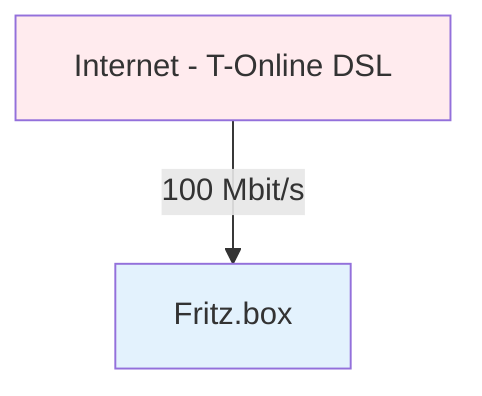

# Infrastructure Documentation - setz-php Projekt

## Übersicht

Dieses Dokument beschreibt die vollständige Infrastruktur des setz-php Projekts, von der Internet-Anbindung über Netzwerk-Hardware bis zu den einzelnen Services und Stages.

**Dokumentationsstatus:** In Bearbeitung - Iteration 1
**Letzte Aktualisierung:** 2025-10-02
**Version:** 0.1.0

---

## Infrastruktur-Diagramm

---

## Iterationen

### Iteration 1: Internet-Anbindung

**Datum:** 2025-10-02
**Status:** Abgeschlossen

**Komponente:** Internet-Zugang

**Beschreibung:**
- **Provider:** T-Online (Deutsche Telekom)
- **Technologie:** DSL
- **Bandbreite:** 100 Mbit/s Download
- **Redundanz:** Keine dedizierte Backup-Leitung
- **Notfall-Backup:** Tethering möglich (manuell)

**Security-Aspekte:**
- Single Point of Failure (keine automatische Redundanz)
- Bei DSL-Ausfall: Manuelles Tethering als Notfall-Lösung

**Verbindung:**
- Internet → Fritz.box (100 Mbit/s)

**Nächste Schritte:**
- Fritz.box Details klären (Modell, Konfiguration)
- Server-Verbindungen hinzufügen

---

## Komponenten-Details

### Internet-Anbindung

**Provider:** T-Online (Deutsche Telekom)
**Technologie:** DSL
**Bandbreite:** 100 Mbit/s Download
**Upload:** Typisch ~40 Mbit/s bei 100 Mbit/s DSL (asymmetrisch)
**Verfügbarkeit:** Single Connection (kein automatisches Failover)

**Backup-Strategie:**
- Kein automatisches Backup
- Manuelles Tethering bei Ausfall möglich
- Ausfallzeit bei Provider-Problemen

### Fritz.box Router

**Typ:** Netzwerk-Gateway
**Funktion:** Router und Firewall

**Details folgen in nächsten Iterationen:**
- Modell-Nummer
- Firmware-Version
- Konfiguration
- Port-Forwarding-Regeln
- Firewall-Einstellungen

---

## Security-Analyse

### Internet-Anbindung

**Risiken:**
- ⚠️ **Single Point of Failure:** Keine automatische Redundanz
- ⚠️ **DSL-Anschluss:** Anfällig für Leitungsstörungen
- ⚠️ **Kein DDoS-Schutz:** Außer Standard-Provider-Maßnahmen

**Mitigationen:**
- ✅ Tethering als manuelle Backup-Option verfügbar
- ✅ Provider-seitige Firewall (T-Online Standard)

**Monitoring:**
- [ ] Uptime-Monitoring für Hauptdomain (setz.de)
- [ ] Alert bei Verbindungsabbruch

### Fritz.box Router

**Zu klärende Security-Aspekte:**
- [ ] Welche Ports sind nach außen offen?
- [ ] Welche Firewall-Regeln sind aktiv?
- [ ] Ist NAT aktiviert?
- [ ] Gibt es VPN-Zugriff?
- [ ] Wie ist das Admin-Interface geschützt?

---

## Änderungshistorie

| Datum | Iteration | Änderung | Autor |
|-------|-----------|----------|-------|
| 2025-10-02 | 1 | Internet-Anbindung hinzugefügt (T-Online DSL, 100 Mbit/s) | Claude |
| 2025-10-02 | 0 | Initiale Erstellung mit Fritz.box Knoten | Claude |

---

*Dieses Dokument folgt dem Prozess beschrieben in [docs/CLAUDE.md](CLAUDE.md)*
