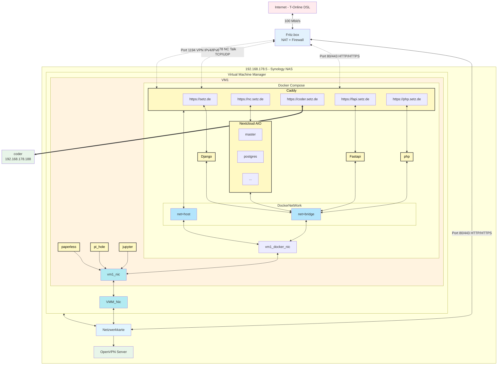

# Infrastructure Documentation - setz-php Projekt

## Übersicht

Dieses Dokument beschreibt die vollständige Infrastruktur des setz-php Projekts, von der Internet-Anbindung über Netzwerk-Hardware bis zu den einzelnen Services und Stages.

**Dokumentationsstatus:** In Bearbeitung - Iteration 3
**Letzte Aktualisierung:** 2025-10-03
**Version:** 0.2.0

---

## Infrastruktur-Diagramm



---

## Iterationen

### Iteration 1: Internet-Anbindung

**Datum:** 2025-10-02
**Status:** Abgeschlossen

**Komponente:** Internet-Zugang

**Beschreibung:**
- **Provider:** T-Online (Deutsche Telekom)
- **Technologie:** DSL
- **Bandbreite:** 100 Mbit/s Download
- **Redundanz:** Keine dedizierte Backup-Leitung
- **Notfall-Backup:** Tethering möglich (manuell)

**Security-Aspekte:**
- Single Point of Failure (keine automatische Redundanz)
- Bei DSL-Ausfall: Manuelles Tethering als Notfall-Lösung

**Verbindung:**
- Internet → Fritz.box (100 Mbit/s)

---

### Iteration 2: Fritz.box Router & Port-Forwarding

**Datum:** 2025-10-02
**Status:** Abgeschlossen

**Komponente:** Fritz.box Router mit NAT und Firewall

**Port-Forwarding Regeln:**

**Server 192.168.178.109 (Webserver + Nextcloud):**
- **Port 80 (HTTP)** → 192.168.178.109
- **Port 443 (HTTPS)** → 192.168.178.109
- **Port 3478 TCP (Nextcloud Talk)** → 192.168.178.109
- **Port 3478 UDP (Nextcloud Talk)** → 192.168.178.109

**Server 192.168.178.5 (VPN Server):**
- **Port 1194 (OpenVPN IPv4)** → 192.168.178.5
- **Port 1194 (OpenVPN IPv6)** → 192.168.178.5

**Netzwerk-Konfiguration:**
- **Internes Netz:** 192.168.178.0/24
- **NAT:** Aktiviert
- **Zwei Server identifiziert:**
  - 192.168.178.109 (Webserver + Nextcloud)
  - 192.168.178.5 (VPN Server)

**Security-Aspekte:**
- ⚠️ **Exponierte Dienste:** HTTP, HTTPS, Nextcloud Talk, OpenVPN
- ⚠️ **HTTP Port 80 offen:** Potentielles Risiko (sollte auf HTTPS redirecten)
- ✅ **HTTPS Port 443:** Verschlüsselte Verbindung
- ✅ **VPN Server:** Sicherer Remote-Zugriff möglich

**Offene Fragen:**
- Fritz.box Modell-Nummer unbekannt
- Firmware-Version unbekannt
- Admin-Interface Sicherung unbekannt
- Firewall-Regeln-Details unbekannt

**Nächste Schritte:**
- ✅ Server-Details geklärt (Iteration 3)
- ✅ VM-Architektur identifiziert (Synology als Hypervisor)

---

### Iteration 3: Server 192.168.178.109 & Synology NAS - Detaillierte Netzwerk-Topologie

**Datum:** 2025-10-03 - 2025-10-04
**Status:** Abgeschlossen

**Komponenten:** VM auf Synology NAS mit Docker Compose Setup

**Beschreibung:**

**Synology NAS (192.168.178.5):**
- **Typ:** Physischer Server (Synology NAS)
- **Standort:** On-Premise (vor Ort)
- **Funktionen:**
  - VPN Server (OpenVPN Port 1194)
  - Hypervisor für VMs (Virtual Machine Manager)
  - Storage/Backup-System
- **Netzwerk:** Physische Netzwerkkarte (SYNOLOGY_NIC) mit IP 192.168.178.5

**Virtual Machine Manager (VMM):**
- Hypervisor auf Synology NAS
- Hostet mindestens eine VM (192.168.178.109)
- Eigene virtuelle Netzwerkkarte (VMM_NIC)

**VM 192.168.178.109 (Ubuntu 24):**
- **Typ:** Virtuelle Maschine
- **Host:** Synology NAS Virtual Machine Manager
- **Betriebssystem:** Ubuntu 24.04 LTS
- **Virtuelle Netzwerkkarte:** vm1_nic
- **Docker Compose Setup:**

**Docker Compose Container:**
1. **Caddy (Reverse Proxy)**
   - Netzwerk-Modus: net=host
   - HTTPS Endpoints:
     - https://setz.de → Django
     - https://nc.setz.de → Nextcloud AIO
     - https://coder.setz.de → Coder (192.168.178.188)
     - https://fapi.setz.de → FastAPI
     - https://php.setz.de → PHP
   - Automatisches HTTPS (Let's Encrypt)

2. **Nextcloud AIO (All-in-One)**
   - Netzwerk-Modus: net=bridge
   - Komponenten: master, postgres, weitere

3. **Django**
   - Netzwerk-Modus: net=bridge
   - Backend für setz.de

4. **FastAPI**
   - Netzwerk-Modus: net=bridge
   - API-Backend

5. **PHP**
   - Netzwerk-Modus: net=bridge
   - PHP-Anwendungen

**Zusätzliche Services (außerhalb Docker Compose):**
- **Jupyter** - Direkt an VM1_NIC
- **Pi-hole** - Direkt an VM1_NIC (Port 81)
- **Paperless** - Direkt an VM1_NIC (Port 8001)

**Netzwerk-Topologie:**
```
Internet → Router → SYNOLOGY_NIC → VMM_NIC → VM1_NIC
                                              ↓
                                         VM1_DOCKER_NIC
                                      ↙               ↘
                        net=host (Caddy)    net=bridge (Container)
```

**Port-Forwarding:**
- Router Port 80/443 → SYNOLOGY_NIC → Caddy (net=host)
- Router Port 3478 → SYNOLOGY_NIC → Caddy (für Nextcloud Talk)
- Router Port 1194 → SYNOLOGY_NIC → OpenVPN

**Externer Server:**
- **Coder Workspace:** 192.168.178.188 (separater Server, erreichbar via coder.setz.de)

**Security-Aspekte:**

**Synology NAS:**
- ✅ **Zentrales System:** Single Point of Failure (SPOF)
- ✅ **VPN-Zugang:** OpenVPN für sicheren Remote-Zugriff
- ⚠️ **Kritisches Asset:** Kompromittierung betrifft alle VMs
- [ ] **DSM Version:** Unbekannt
- [ ] **Backup der NAS:** Noch zu klären

**VM 192.168.178.109:**
- ✅ **VM-Isolation:** Läuft isoliert vom Host
- ✅ **Caddy mit HTTPS:** Automatische TLS-Zertifikate
- ✅ **Docker Netzwerk-Segmentierung:**
  - Caddy im host-Modus (direkter Port-Zugriff)
  - Alle Backend-Services im bridge-Modus (isoliert)
- ⚠️ **Mehrere exponierte Services:** Größere Angriffsfläche
- [ ] **Container-Updates:** Update-Strategie?
- [ ] **Resource Limits:** CPU/RAM-Limits gesetzt?

**Offene Fragen:**
- Synology Modell und DSM Version?
- Weitere VMs auf der Synology?
- Storage-Konfiguration (RAID, Kapazität)?
- Backup-Strategie?
- VM-Snapshot-Policy?

---

## Komponenten-Details

### Internet-Anbindung

**Provider:** T-Online (Deutsche Telekom)
**Technologie:** DSL
**Bandbreite:** 100 Mbit/s Download
**Upload:** Typisch ~40 Mbit/s bei 100 Mbit/s DSL (asymmetrisch)
**Verfügbarkeit:** Single Connection (kein automatisches Failover)

**Backup-Strategie:**
- Kein automatisches Backup
- Manuelles Tethering bei Ausfall möglich
- Ausfallzeit bei Provider-Problemen

### Fritz.box Router

**Typ:** Netzwerk-Gateway
**Funktion:** Router, NAT, Firewall

**Netzwerk-Konfiguration:**
- **Internes Netz:** 192.168.178.0/24
- **Router-IP:** 192.168.178.1 (Standard)
- **NAT:** Aktiviert
- **DHCP:** Vermutlich aktiv

**Port-Forwarding (Exponierte Services):**

| Port | Protokoll | Ziel | Service |
|------|-----------|------|---------|
| 80 | TCP | 192.168.178.109 | HTTP (Web) |
| 443 | TCP | 192.168.178.109 | HTTPS (Web) |
| 3478 | TCP | 192.168.178.109 | Nextcloud Talk |
| 3478 | UDP | 192.168.178.109 | Nextcloud Talk |
| 1194 | TCP/UDP | 192.168.178.5 | OpenVPN (IPv4/IPv6) |

**Unbekannte Details:**
- Modell-Nummer (z.B. Fritz!Box 7590)
- Firmware-Version
- Admin-Interface Zugriff (intern/extern)
- Detaillierte Firewall-Regeln

### Synology NAS (192.168.178.5)

**Typ:** Physischer Server (Synology Network Attached Storage)
**Standort:** On-Premise (vor Ort)

**Funktionen:**
1. **Hypervisor** - Hostet virtuelle Maschinen
2. **VPN Server** - OpenVPN (Port 1194)
3. **Storage/Backup** - Zentrale Datenspeicherung (vermutlich)

**Exponierte Services:**
- OpenVPN (Port 1194 TCP/UDP, IPv4 + IPv6)

**Gehostete VMs:**
- 192.168.178.109 (Ubuntu 24 - Caddy + Nextcloud AIO)
- Weitere VMs möglich (noch unbekannt)

**Unbekannte Details:**
- Synology Modell (z.B. DS920+, DS1621+)
- DSM Version (DiskStation Manager)
- Hypervisor-Typ (Virtual Machine Manager?)
- Storage-Konfiguration (RAID-Level, Kapazität, HDD/SSD)
- Backup-Strategie für die NAS selbst
- Anzahl weiterer VMs

**Kritisches Asset:**
- ⚠️ Single Point of Failure für alle VMs
- ⚠️ Kompromittierung betrifft gesamte Infrastruktur

### VM 192.168.178.109 (Ubuntu 24)

**Typ:** Virtuelle Maschine
**Host:** Synology NAS 192.168.178.5
**Betriebssystem:** Ubuntu 24.04 LTS

**Exponierte Services:**
- HTTP (Port 80) via Caddy
- HTTPS (Port 443) via Caddy
- Nextcloud Talk (Port 3478 TCP/UDP)

**Installierte Services:**
1. **Caddy Reverse Proxy**
   - Automatisches HTTPS (Let's Encrypt)
   - Moderne, sichere Alternative zu Nginx/Apache
2. **Nextcloud AIO** (All-in-One)
   - nc.setz.de (Nextcloud-Instanz)
   - Enthält: Nextcloud, Talk, Office, etc.
3. **Diverse weitere Services** (Details noch unbekannt)

**Vermutete Domains:**
- setz.de (dieser Laravel-Webserver?)
- nc.setz.de (Nextcloud)

**Unbekannte Details:**
- VM-Ressourcen (CPU-Kerne, RAM-Größe)
- Disk-Größe der VM
- Welche "diversen Services" laufen noch?
- Werden VM-Snapshots erstellt?
- Resource Limits gesetzt?

---

## Security-Analyse

### Internet-Anbindung

**Risiken:**
- ⚠️ **Single Point of Failure:** Keine automatische Redundanz
- ⚠️ **DSL-Anschluss:** Anfällig für Leitungsstörungen
- ⚠️ **Kein DDoS-Schutz:** Außer Standard-Provider-Maßnahmen

**Mitigationen:**
- ✅ Tethering als manuelle Backup-Option verfügbar
- ✅ Provider-seitige Firewall (T-Online Standard)

**Monitoring:**
- [ ] Uptime-Monitoring für Hauptdomain (setz.de)
- [ ] Alert bei Verbindungsabbruch

### Fritz.box Router

**Exponierte Ports (bekannt):**
- ✅ **Port 80 (HTTP)** → 192.168.178.109
- ✅ **Port 443 (HTTPS)** → 192.168.178.109
- ✅ **Port 3478 (TCP/UDP)** → 192.168.178.109 (Nextcloud Talk)
- ✅ **Port 1194 (TCP/UDP)** → 192.168.178.5 (OpenVPN)

**Risiken:**
- ⚠️ **Port 80 HTTP:** Unverschlüsselter Traffic möglich
  - **Mitigation:** Sollte auf HTTPS (443) redirecten
- ⚠️ **Nextcloud Talk Port 3478:** WebRTC-Kommunikation
  - **Status:** Standard-Port für STUN/TURN
- ⚠️ **4 Services exponiert:** Größere Angriffsfläche
  - **Mitigation:** VPN-Zugang verfügbar für Admin-Tasks

**Noch zu klären:**
- [ ] Ist Fritz.box Admin-Interface von außen erreichbar?
- [ ] Gibt es Rate-Limiting für exponierte Ports?
- [ ] Werden Failed-Login-Attempts geloggt?
- [ ] Ist UPnP aktiviert (Sicherheitsrisiko)?

### Synology NAS (192.168.178.5)

**Angriffsvektoren:**
- ⚠️ **Single Point of Failure:** Kompromittierung betrifft alle VMs
- ⚠️ **OpenVPN Port 1194:** Brute-Force möglich
- ⚠️ **Hypervisor-Schwachstellen:** VM-Escape-Angriffe theoretisch möglich
- ⚠️ **DSM-Schwachstellen:** Synology OS muss aktuell gehalten werden

**Mitigationen:**
- ✅ OpenVPN = verschlüsselt
- ✅ Zertifikat-basierte Authentifizierung (zu verifizieren)
- ✅ VM-Isolation durch Hypervisor
- [ ] DSM Version aktuell?
- [ ] Fail2Ban für VPN aktiv?
- [ ] Strong Password/Certificate Policy?
- [ ] IPv6 OpenVPN korrekt konfiguriert?
- [ ] Hypervisor-Updates regelmäßig?
- [ ] Backup der NAS selbst (extern)?

**Kritische Maßnahmen:**
- [ ] Regelmäßige Synology Security Advisories prüfen
- [ ] Externes Backup der gesamten NAS
- [ ] VM-Snapshots vor größeren Changes
- [ ] Monitoring der NAS-Ressourcen (CPU, RAM, Disk)

### VM 192.168.178.109 (Ubuntu 24 - Caddy + Nextcloud)

**Angriffsvektoren:**
- ⚠️ **HTTP Port 80:** Man-in-the-Middle möglich (falls kein Redirect)
- ⚠️ **HTTPS Port 443:** Zertifikatsverwaltung kritisch
- ⚠️ **Nextcloud Talk:** WebRTC-Exploits
- ⚠️ **Ubuntu 24:** Sehr neue Version, evtl. noch instabil
- ⚠️ **Diverse Services:** Unbekannte Angriffsfläche

**Mitigationen:**
- ✅ HTTPS verfügbar
- ✅ VPN-Zugang für Admin-Zugriff
- ✅ **Caddy Reverse Proxy:**
  - Automatisches HTTPS (Let's Encrypt)
  - Sichere Defaults out-of-the-box
  - Modernes, sicheres Design
- ✅ **VM-Isolation:** Läuft isoliert vom Host
- ✅ **Nextcloud AIO:** Vereinfachte Updates
- [ ] HTTP→HTTPS Redirect aktiv? (Caddy macht das i.d.R. automatisch)
- [ ] TLS-Version und Cipher-Suites prüfen
- [ ] Nextcloud-Version aktuell halten (AIO vereinfacht dies)
- [ ] Ubuntu Security Updates aktiviert?
- [ ] Firewall in der VM aktiv (ufw)?
- [ ] Welche "diversen Services" laufen?
- [ ] Resource Limits für VM gesetzt?
- [ ] VM-Snapshots vor Updates?

**Best Practices (zu verifizieren):**
- [ ] Unattended-upgrades für Security-Patches
- [ ] Fail2Ban für Caddy/SSH
- [ ] Regelmäßige VM-Backups/Snapshots
- [ ] Log-Rotation konfiguriert
- [ ] Monitoring der VM-Ressourcen

---

## Änderungshistorie

| Datum | Iteration | Änderung | Autor |
|-------|-----------|----------|-------|
| 2025-10-04 | 3 | Detaillierte Netzwerk-Topologie: Docker Compose (Caddy, Django, Nextcloud AIO, FastAPI, PHP), Jupyter, Pi-hole, Paperless, Coder Server (192.168.178.188), Mermaid mit Click-Links | Claude |
| 2025-10-02 | 2 | Fritz.box Port-Forwarding + 2 Server identifiziert (109, 5) | Claude |
| 2025-10-02 | 1 | Internet-Anbindung hinzugefügt (T-Online DSL, 100 Mbit/s) | Claude |
| 2025-10-02 | 0 | Initiale Erstellung mit Fritz.box Knoten | Claude |

---

*Dieses Dokument folgt dem Prozess beschrieben in [docs/CLAUDE.md](CLAUDE.md)*
