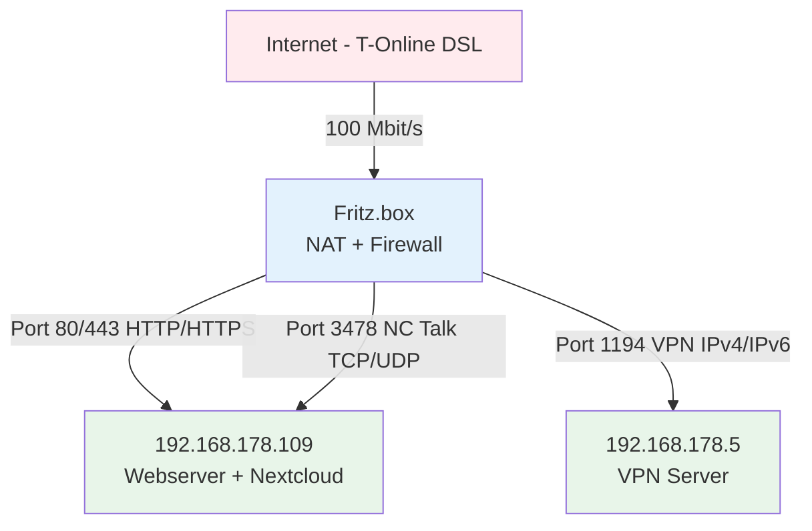

# Infrastructure Documentation - setz-php Projekt

## Übersicht

Dieses Dokument beschreibt die vollständige Infrastruktur des setz-php Projekts, von der Internet-Anbindung über Netzwerk-Hardware bis zu den einzelnen Services und Stages.

**Dokumentationsstatus:** In Bearbeitung - Iteration 1
**Letzte Aktualisierung:** 2025-10-02
**Version:** 0.1.0

---

## Infrastruktur-Diagramm

---

## Iterationen

### Iteration 1: Internet-Anbindung

**Datum:** 2025-10-02
**Status:** Abgeschlossen

**Komponente:** Internet-Zugang

**Beschreibung:**
- **Provider:** T-Online (Deutsche Telekom)
- **Technologie:** DSL
- **Bandbreite:** 100 Mbit/s Download
- **Redundanz:** Keine dedizierte Backup-Leitung
- **Notfall-Backup:** Tethering möglich (manuell)

**Security-Aspekte:**
- Single Point of Failure (keine automatische Redundanz)
- Bei DSL-Ausfall: Manuelles Tethering als Notfall-Lösung

**Verbindung:**
- Internet → Fritz.box (100 Mbit/s)

---

### Iteration 2: Fritz.box Router & Port-Forwarding

**Datum:** 2025-10-02
**Status:** Abgeschlossen

**Komponente:** Fritz.box Router mit NAT und Firewall

**Port-Forwarding Regeln:**

**Server 192.168.178.109 (Webserver + Nextcloud):**
- **Port 80 (HTTP)** → 192.168.178.109
- **Port 443 (HTTPS)** → 192.168.178.109
- **Port 3478 TCP (Nextcloud Talk)** → 192.168.178.109
- **Port 3478 UDP (Nextcloud Talk)** → 192.168.178.109

**Server 192.168.178.5 (VPN Server):**
- **Port 1194 (OpenVPN IPv4)** → 192.168.178.5
- **Port 1194 (OpenVPN IPv6)** → 192.168.178.5

**Netzwerk-Konfiguration:**
- **Internes Netz:** 192.168.178.0/24
- **NAT:** Aktiviert
- **Zwei Server identifiziert:**
  - 192.168.178.109 (Webserver + Nextcloud)
  - 192.168.178.5 (VPN Server)

**Security-Aspekte:**
- ⚠️ **Exponierte Dienste:** HTTP, HTTPS, Nextcloud Talk, OpenVPN
- ⚠️ **HTTP Port 80 offen:** Potentielles Risiko (sollte auf HTTPS redirecten)
- ✅ **HTTPS Port 443:** Verschlüsselte Verbindung
- ✅ **VPN Server:** Sicherer Remote-Zugriff möglich

**Offene Fragen:**
- Fritz.box Modell-Nummer unbekannt
- Firmware-Version unbekannt
- Admin-Interface Sicherung unbekannt
- Firewall-Regeln-Details unbekannt

**Nächste Schritte:**
- Server-Details klären (192.168.178.109 und 192.168.178.5)
- Physische/Virtuelle Maschinen identifizieren

---

## Komponenten-Details

### Internet-Anbindung

**Provider:** T-Online (Deutsche Telekom)
**Technologie:** DSL
**Bandbreite:** 100 Mbit/s Download
**Upload:** Typisch ~40 Mbit/s bei 100 Mbit/s DSL (asymmetrisch)
**Verfügbarkeit:** Single Connection (kein automatisches Failover)

**Backup-Strategie:**
- Kein automatisches Backup
- Manuelles Tethering bei Ausfall möglich
- Ausfallzeit bei Provider-Problemen

### Fritz.box Router

**Typ:** Netzwerk-Gateway
**Funktion:** Router, NAT, Firewall

**Netzwerk-Konfiguration:**
- **Internes Netz:** 192.168.178.0/24
- **Router-IP:** 192.168.178.1 (Standard)
- **NAT:** Aktiviert
- **DHCP:** Vermutlich aktiv

**Port-Forwarding (Exponierte Services):**

| Port | Protokoll | Ziel | Service |
|------|-----------|------|---------|
| 80 | TCP | 192.168.178.109 | HTTP (Web) |
| 443 | TCP | 192.168.178.109 | HTTPS (Web) |
| 3478 | TCP | 192.168.178.109 | Nextcloud Talk |
| 3478 | UDP | 192.168.178.109 | Nextcloud Talk |
| 1194 | TCP/UDP | 192.168.178.5 | OpenVPN (IPv4/IPv6) |

**Unbekannte Details:**
- Modell-Nummer (z.B. Fritz!Box 7590)
- Firmware-Version
- Admin-Interface Zugriff (intern/extern)
- Detaillierte Firewall-Regeln

### Server 192.168.178.109

**Typ:** Webserver + Nextcloud
**Funktion:** Public Web Services

**Exponierte Services:**
- HTTP (Port 80)
- HTTPS (Port 443)
- Nextcloud Talk (Port 3478 TCP/UDP)

**Vermutete Services:**
- setz.de (Webserver)
- nc.setz.de (Nextcloud)

**Details folgen in nächsten Iterationen:**
- Physisch oder VM?
- Betriebssystem
- Hardware-Specs
- Weitere Services

### Server 192.168.178.5

**Typ:** VPN Server
**Funktion:** Sichere Remote-Verbindung

**Exponierte Services:**
- OpenVPN (Port 1194 TCP/UDP, IPv4 + IPv6)

**Details folgen in nächsten Iterationen:**
- Physisch oder VM?
- Betriebssystem
- Hardware-Specs
- VPN-Konfiguration

---

## Security-Analyse

### Internet-Anbindung

**Risiken:**
- ⚠️ **Single Point of Failure:** Keine automatische Redundanz
- ⚠️ **DSL-Anschluss:** Anfällig für Leitungsstörungen
- ⚠️ **Kein DDoS-Schutz:** Außer Standard-Provider-Maßnahmen

**Mitigationen:**
- ✅ Tethering als manuelle Backup-Option verfügbar
- ✅ Provider-seitige Firewall (T-Online Standard)

**Monitoring:**
- [ ] Uptime-Monitoring für Hauptdomain (setz.de)
- [ ] Alert bei Verbindungsabbruch

### Fritz.box Router

**Exponierte Ports (bekannt):**
- ✅ **Port 80 (HTTP)** → 192.168.178.109
- ✅ **Port 443 (HTTPS)** → 192.168.178.109
- ✅ **Port 3478 (TCP/UDP)** → 192.168.178.109 (Nextcloud Talk)
- ✅ **Port 1194 (TCP/UDP)** → 192.168.178.5 (OpenVPN)

**Risiken:**
- ⚠️ **Port 80 HTTP:** Unverschlüsselter Traffic möglich
  - **Mitigation:** Sollte auf HTTPS (443) redirecten
- ⚠️ **Nextcloud Talk Port 3478:** WebRTC-Kommunikation
  - **Status:** Standard-Port für STUN/TURN
- ⚠️ **4 Services exponiert:** Größere Angriffsfläche
  - **Mitigation:** VPN-Zugang verfügbar für Admin-Tasks

**Noch zu klären:**
- [ ] Ist Fritz.box Admin-Interface von außen erreichbar?
- [ ] Gibt es Rate-Limiting für exponierte Ports?
- [ ] Werden Failed-Login-Attempts geloggt?
- [ ] Ist UPnP aktiviert (Sicherheitsrisiko)?

### Server 192.168.178.109 (Web + Nextcloud)

**Angriffsvektoren:**
- ⚠️ **HTTP Port 80:** Man-in-the-Middle möglich
- ⚠️ **HTTPS Port 443:** Zertifikatsverwaltung kritisch
- ⚠️ **Nextcloud Talk:** WebRTC-Exploits

**Mitigationen:**
- ✅ HTTPS verfügbar
- ✅ VPN-Zugang für Admin-Zugriff
- [ ] HTTP→HTTPS Redirect verifizieren
- [ ] TLS-Version und Cipher-Suites prüfen
- [ ] Nextcloud-Version aktuell halten

### Server 192.168.178.5 (VPN)

**Angriffsvektoren:**
- ⚠️ **OpenVPN Port 1194:** Brute-Force möglich

**Mitigationen:**
- ✅ OpenVPN = verschlüsselt
- ✅ Zertifikat-basierte Authentifizierung (zu verifizieren)
- [ ] Fail2Ban aktiv?
- [ ] Strong Password/Certificate Policy?
- [ ] IPv6 OpenVPN korrekt konfiguriert?

---

## Änderungshistorie

| Datum | Iteration | Änderung | Autor |
|-------|-----------|----------|-------|
| 2025-10-02 | 2 | Fritz.box Port-Forwarding + 2 Server identifiziert (109, 5) | Claude |
| 2025-10-02 | 1 | Internet-Anbindung hinzugefügt (T-Online DSL, 100 Mbit/s) | Claude |
| 2025-10-02 | 0 | Initiale Erstellung mit Fritz.box Knoten | Claude |

---

*Dieses Dokument folgt dem Prozess beschrieben in [docs/CLAUDE.md](CLAUDE.md)*
