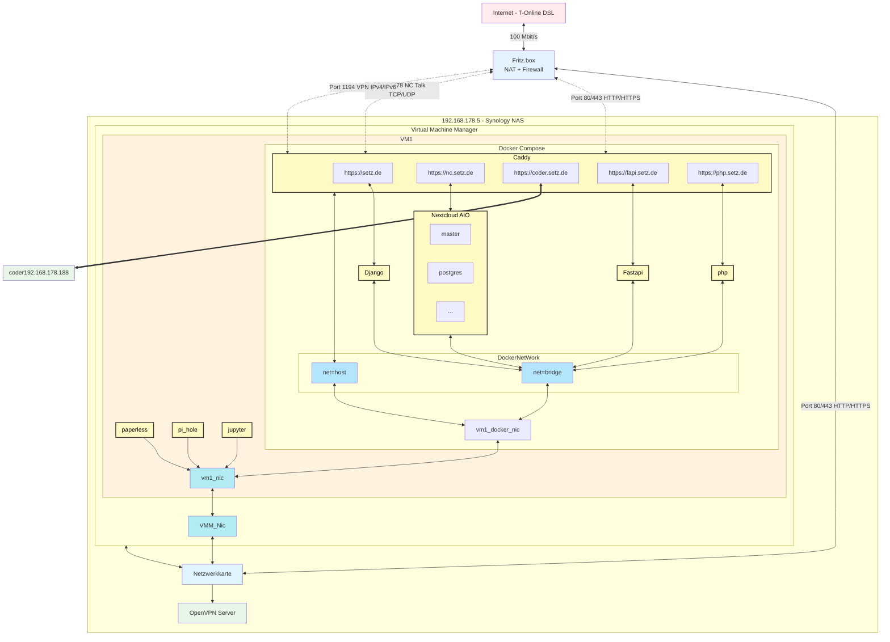

```mermaid
graph TD
    Internet[Internet - T-Online DSL]
    Router[Fritz.box<br/>NAT + Firewall]

    subgraph CODER["coder<br\>192.168.178.188 "]
    end
    subgraph Synology["192.168.178.5 - Synology NAS"]
        SYNOLOGY_NIC[Netzwerkkarte]
        VPN[OpenVPN Server]

        subgraph VMM["Virtual Machine Manager"]
            VMM_NIC["VMM_Nic"]
            subgraph VM1["VM1 <br/> 192.168.178.109 - Ubuntu 24 VM"]
                VM1_NIC["vm1_nic"]
                subgraph Docker["Docker Compose"]
                    VM1_DOCKER_NIC["vm1_docker_nic"]
                    subgraph CADDY["Caddy"]
                      TSL_SETZ_DE["https://setz.de"]
                      TSL_NC_SETZ_DE["https://nc.setz.de"]
                      TSL_CODER_SETZ_DE["https://coder.setz.de"]
                      TSL_FASTAPI_SETZ_DE["https://fapi.setz.de"]
                      TSL_PHP_SETZ_DE["https://php.setz.de"]
                    end
    
                    subgraph DJANGO["Django"]
                      %%VM1_DJANGO_NET["net=bridge"]
                    end
                    subgraph NC_AIO["Nextcloud AIO"]
                      %%VM1_NC_AIO_NET["net=bridge"]
                      VM1_NC_AIO_MASTER["master"]
                      VM1_NC_AIO_POSTGRES["postgres"]
                      VM1_NC_AIO_OTHER["..."]
                    end
                    subgraph VM1_DOCKER_ROUTER["DockerNetWork"]
                      VM1_DOCKER_ROUTER_HOST["net=host"]
                      VM1_DOCKER_ROUTER_BRIDGE["net=bridge"]
                    end
                    subgraph FASTAPI["Fastapi"]
                      %%VM1_FASTAPI_NET["net=bridge"]
                    end
                    subgraph PHP["php"]
                      %%VM1_PHP_NET["net=bridge"]
                    end

                    TSL_SETZ_DE <--> DJANGO
                    TSL_NC_SETZ_DE <--> NC_AIO 
                    TSL_FASTAPI_SETZ_DE <--> FASTAPI
                    TSL_PHP_SETZ_DE <--> PHP
                end
                subgraph JUPYTER ["jupyter"]
                end
                subgraph PI_HOLE["pi_hole"]
                end
                subgraph PAPERLESS["paperless"]
                end
                PAPERLESS-->VM1_NIC
                PI_HOLE -->VM1_NIC
                JUPYTER -->VM1_NIC
            end
            VM1_NIC <--> VMM_NIC 
        end

        %%VM1_FASTAPI_NET <--> VM1_DOCKER_ROUTER_BRIDGE
        CADDY <--> VM1_DOCKER_ROUTER_HOST
        DJANGO <--> VM1_DOCKER_ROUTER_BRIDGE
        NC_AIO <--> VM1_DOCKER_ROUTER_BRIDGE
        FASTAPI <--> VM1_DOCKER_ROUTER_BRIDGE
        PHP <--> VM1_DOCKER_ROUTER_BRIDGE
        SYNOLOGY_NIC <--> VMM
        SYNOLOGY_NIC --> VPN
        VM1_DOCKER_ROUTER_BRIDGE <--> VM1_DOCKER_NIC
        VM1_DOCKER_ROUTER_HOST <--> VM1_DOCKER_NIC
        VM1_DOCKER_NIC <--> VM1_NIC
    end

    TSL_CODER_SETZ_DE <==> CODER

    VMM_NIC <--> SYNOLOGY_NIC
    Internet <-->|100 Mbit/s| Router
    Router <-.->|Port 80/443 HTTP/HTTPS| CADDY
    Router <-.->|Port 3478 NC Talk TCP/UDP| CADDY
    Router <-.->|Port 1194 VPN IPv4/IPv6| CADDY
    Router <-->|Port 80/443 HTTP/HTTPS| SYNOLOGY_NIC
    %%Router <-->|Port 3478 NC Talk TCP/UDP|  SYNOLOGY_NIC
    %%Router <-->|Port 1194 VPN IPv4/IPv6| SYNOLOGY_NIC

    click TSL_SETZ_DE "https://setz.de" _blank
    click TSL_NC_SETZ_DE "https://nc.setz.de" _blank
    click TSL_CODER_SETZ_DE "https://coder.setz.de" _blank
    click TSL_FASTAPI_SETZ_DE "https://fapi.setz.de" _blank
    click TSL_PHP_SETZ_DE "https://php.setz.de" _blank

    classDef external fill:#ffebee
    classDef network fill:#e3f2fd
    classDef server fill:#e8f5e9
    classDef vm fill:#fff3e0
    classDef nic fill:#e1f5fe
    classDef vnic fill:#b2ebf2
    classDef docker fill:#e3f2fd
    classDef dockernet fill:#b3e5fc
    classDef container fill:#fff9c4,color:#000,stroke:#333,stroke-width:2px

    class Internet external
    class Router network
    class SYNOLOGY_NIC nic
    class VMM_NIC,VM1_NIC vnic
    class VPN,CODER server
    class VM1_DOCKER_ROUTER_HOST,VM1_DOCKER_ROUTER_BRIDGE dockernet
    class VM1 vm
    class CADDY,NC_AIO,DJANGO,FASTAPI,PHP,JUPYTER,PI_HOLE,PAPERLESS container
```
