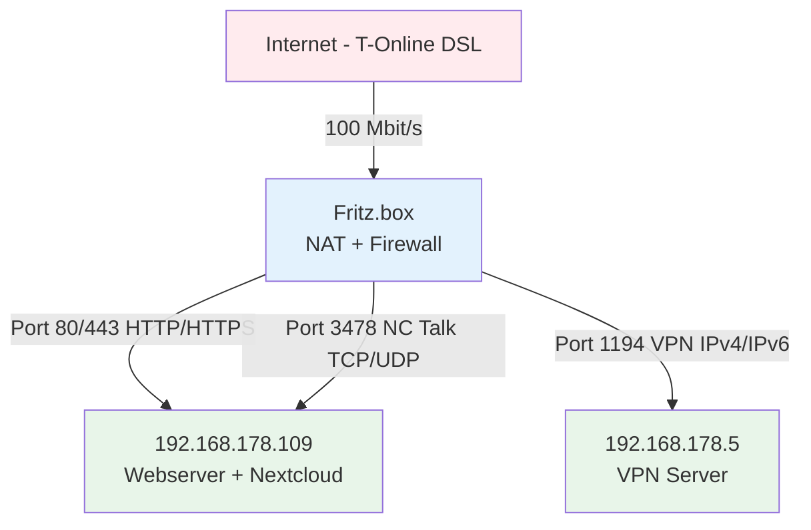

xxx

```mermaid
graph TD
    Internet[Internet - T-Online DSL]
    Router[Fritz.box<br/>NAT + Firewall]
    Server1[192.168.178.109<br/>Webserver + Nextcloud]
    Server2[192.168.178.5<br/>VPN Server]

    Internet -->|100 Mbit/s| Router
    Router -->|Port 80/443 HTTP/HTTPS| Server1
    Router -->|Port 3478 NC Talk TCP/UDP| Server1
    Router -->|Port 1194 VPN IPv4/IPv6| Server2

    classDef external fill:#ffebee
    classDef network fill:#e3f2fd
    classDef server fill:#e8f5e9

    class Internet external
    class Router network
    class Server1,Server2 server
```
